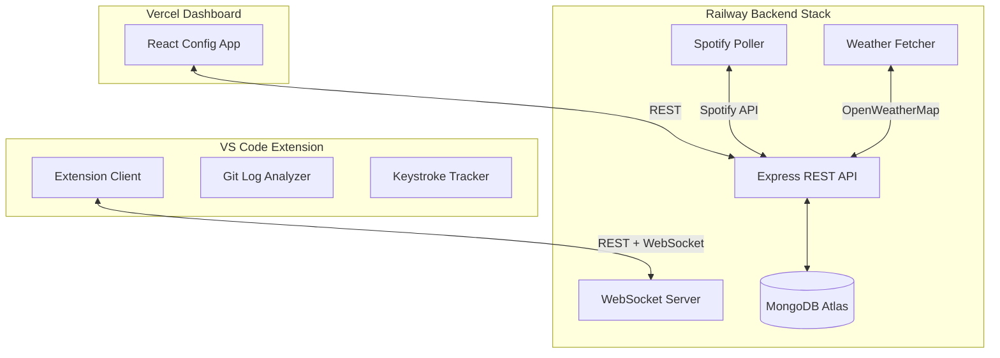

# MoodCode

**Your VS Code theme, matched to your day.**

MoodCode is a VS Code extension and personal web dashboard stack that switches your editor theme dynamically based on real-time signals from your environment. The system integrates multiple telemetry feeds—Spotify activity, typing patterns, local weather, and git commit behavior—to calculate your active developer mood and automatically apply your favorite themes.

---

## Status: Phase 3 Active

* **Phase 1 (Complete)**: Time bracket theme switching, status bar indicator, manual overrides, and WebSocket real-time sync.
* **Phase 2 (Complete)**: Keystroke typing speed tracker, weighted mood engine, and interactive signal weight dashboard sliders.
* **Phase 3 (Complete)**: Spotify OAuth audio feature telemetry, OpenWeatherMap IP geolocation updates, and local Git log pattern analyzer.

---

## Architecture



| Package | Role |
|---------|------|
| [`shared/`](shared/) | Shared TypeScript types, constants, and validation schemas |
| [`extension/`](extension/) | VS Code client: keystroke tracking, local Git child_processes, theme colors, and WebSocket synchronization |
| [`backend/`](backend/) | Express server, WebSocket engine, MongoDB connections, Spotify polling, and IP-based weather caching |
| [`dashboard/`](dashboard/) | React configuration interface, weight sliders, brackets builder, and mood log visualizer |

---

## Prerequisites

- **Node.js** 20+ and npm
- **MongoDB Atlas** or a local instance
- **VS Code** 1.120+
- **Developer API Credentials**:
  - Spotify Client ID and Client Secret (configured via Spotify Developer Dashboard)
  - OpenWeatherMap API Key (from openweathermap.org)

---

## Development Start

1. Install all monorepo dependencies:
   ```bash
   npm install
   ```

2. Configure environment variables in `backend/.env`:
   ```bash
   cp .env.example backend/.env
   # Populate MONGODB_URI, SPOTIFY_CLIENT_ID, SPOTIFY_CLIENT_SECRET, and OPENWEATHER_API_KEY
   ```

3. Launch backend services and dashboard in development workspaces:
   ```bash
   npm run dev
   ```

4. Launch the extension inside VS Code:
   * Press **F5** (*Run Extension*) to open a new Extension Development Host window.

---

## Default Mood Configurations

Brackets are evaluated top-to-bottom (first-match-wins) inside the engine:

| Mood | Default Hours | Default Theme |
|------|---------------|---------------|
| Morning | 06:00 – 10:00 | GitHub Light Default |
| Post-Lunch | 12:00 – 14:00 | One Dark Pro |
| Deep Work | 10:00 – 22:00 | Tokyo Night |
| Late Night | 22:00 – 06:00 | Dracula |

---

## Environment Variables Configuration

Environment variables used by the backend service (`backend/.env`):

| Variable | Description |
|----------|-------------|
| `MONGODB_URI` | Connection string for MongoDB database instance |
| `PORT` | Local server listener port (defaults to `3001`) |
| `SESSION_SECRET` | Secret key used for session cryptographic signatures |
| `SPOTIFY_CLIENT_ID` | App credential from the Spotify Developer Panel |
| `SPOTIFY_CLIENT_SECRET` | Secret key from the Spotify Developer Panel |
| `SPOTIFY_REDIRECT_URI` | OAuth redirect URI (e.g., `https://your-api.railway.app/auth/spotify/callback`) |
| `OPENWEATHER_API_KEY` | API token generated on openweathermap.org |

---

## Project Workspace Compilation

Run compilation commands from the repository root:

```bash
# Rebuild shared ESM/CJS assets and bundle extension with esbuild
npm run compile

# Create the installable .vsix package
npm run package -w extension
```

---

## License

MIT
