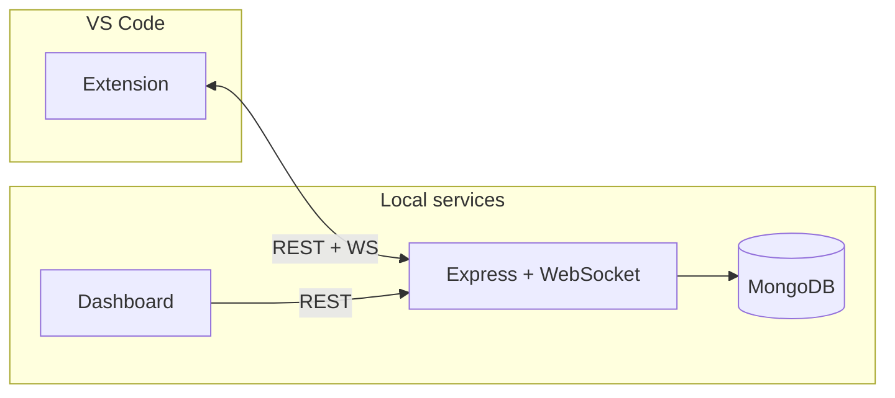

# MoodCode

**Your VS Code theme, matched to your day.**

MoodCode is a VS Code extension and local companion stack that switches your editor theme based on time of day and a personal mood config. A small backend and web dashboard let you edit time brackets, map moods to themes, and review mood history — all running on your machine.

> **Status:** MVP — time-based theme switching. Spotify, weather, git, and typing signals are planned for later phases.

---

## Features

- **Automatic theme switching** — Evaluates the current hour against configurable time brackets (morning, deep work, post-lunch, late night).
- **Status bar mood indicator** — See your active mood at a glance.
- **Manual override** — Pin a mood for 1, 2, or 4 hours from the command palette.
- **Personal config dashboard** — React app at `localhost:5173` to edit brackets, themes, and view history.
- **Real-time sync** — Dashboard saves push to the extension over WebSocket.
- **Works offline** — Falls back to built-in defaults if the backend is unavailable.

---

## Architecture



| Package | Role |
|---------|------|
| [`shared/`](shared/) | Shared TypeScript types and constants |
| [`extension/`](extension/) | VS Code extension (theme switching, status bar, commands) |
| [`backend/`](backend/) | Express API, WebSocket server, MongoDB persistence |
| [`dashboard/`](dashboard/) | React + Vite personal config UI |

---

## Prerequisites

- **Node.js** 20+ and npm
- **MongoDB** running locally (default: `mongodb://localhost:27017/moodcode`)
- **VS Code** 1.120+
- **Recommended themes** (install from the Marketplace): GitHub Light, Tokyo Night, One Dark Pro, Dracula

---

## Quick start (development)

```bash
# Clone and install
git clone https://github.com/your-org/moodcode.git
cd moodcode
npm install

# Backend env (once)
cp .env.example backend/.env
# Edit backend/.env if your MongoDB URL differs

# Start MongoDB, then from the repo root:
npm run dev
```

This compiles `shared`, starts the **backend** (`http://localhost:3001`) and **dashboard** (`http://localhost:5173`).

Open the repo in VS Code — workspace tasks can auto-start backend and dashboard on folder open (see [`.vscode/tasks.json`](.vscode/tasks.json)).

To run the **extension** during development, press **F5** in VS Code (*Run Extension*) to open an Extension Development Host window.

```bash
# Build everything
npm run build

# Extension tests
npm run test -w moodcode
```

---

## Default moods & themes

| Mood | Default hours | Default theme |
|------|---------------|---------------|
| Morning | 06:00 – 10:00 | GitHub Light |
| Deep work | 10:00 – 22:00 | Tokyo Night |
| Post-lunch | 12:00 – 14:00 | One Dark Pro |
| Late night | 22:00 – 06:00 | Dracula |

Brackets are evaluated top-to-bottom; the first match wins. Place narrower brackets (e.g. post-lunch) before wider ones (e.g. deep work).

---

## Project structure

```
moodcode/
├── shared/          # Types, constants (dual CJS/ESM build)
├── extension/       # VS Code extension
├── backend/         # API + WebSocket + MongoDB
├── dashboard/       # Config UI
├── package.json     # npm workspaces root
└── .env.example     # Environment template for backend
```

---

## Configuration

Environment variables for the backend (`backend/.env`):

| Variable | Default | Description |
|----------|---------|-------------|
| `MONGODB_URI` | `mongodb://localhost:27017/moodcode` | MongoDB connection string |
| `PORT` | `3001` | HTTP + WebSocket port |
| `SESSION_SECRET` | — | Reserved for future OAuth |

The extension and dashboard use localhost URLs by default. See [`extension/README.md`](extension/README.md) for VS Code settings.

---

## Packaging the extension

```bash
cd extension
npx @vscode/vsce package
```

Prepublish builds the extension and bundles the backend into `extension/server/` for a self-contained `.vsix`. MongoDB must still be available at runtime.

---

## Roadmap

| Phase | Focus |
|-------|--------|
| **MVP (current)** | Time-of-day signal, dashboard, logging, WebSocket config sync |
| Phase 2 | Spotify, weather, git signals |
| Phase 3 | Weighted mood scoring in dashboard |
| Phase 4 | Typing pattern signal |
| Later | Marketplace publish, shareable mood reports |

---

## Contributing

Contributions are welcome. Please open an issue before large changes.

1. Fork the repository
2. Create a feature branch (`git checkout -b feature/my-change`)
3. Commit with clear messages
4. Open a pull request

For AI-assisted work in this repo, see [`MOODCODE_CONTEXT.md`](MOODCODE_CONTEXT.md) for architecture and MVP constraints.

---

## License

MIT — see [`extension/package.json`](extension/package.json). A root `LICENSE` file may be added in a follow-up.

---

## Links

- [Extension README & marketplace docs](extension/README.md)
- [VS Code Extension API](https://code.visualstudio.com/api)
